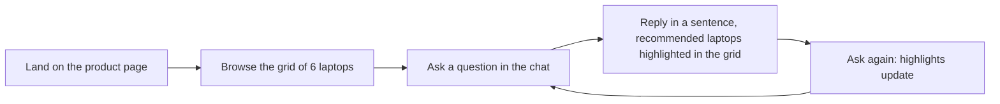

# Design

Designer: Atilade (@atiladeokegab). Owned by the designer: to change anything here, open a
change-request (AGENTS.md §7) addressed to them. Each vertical's `Design:` line says which
sections of this page it must follow.

The mockup is `docs/mockup/index.html`: every screen and state, clickable, with the exact copy.
Open it straight from the file system; the "State" bar at the top switches between states.

References (described in words, no images or links):

- **A clean, light fintech landing page**, as in the "Seen" design of the lead's dry run #3: a
  white page, near-black text, one heavy uppercase headline that carries the page, generous
  white space, rounded white cards lifted by a soft shadow, black pill-shaped buttons, and a
  single indigo accent used only for what matters (here: what the assistant recommends).

## The look

| Token | Value | Use |
|---|---|---|
| Background | `#FFFFFF` page, `#F4F4F5` panel and skeletons | White page; the chat panel sits on a faint grey |
| Ink | `#0A0A0A` | Headline, product names, body text |
| Muted ink | `#52525B` | Specs, hints, captions (7.7:1 on white) |
| Border | `#E4E4E7` | Card and input outlines |
| Accent | `#4F46E5` indigo | Recommended ring, "Recommended" badge, focus ring, user chat bubble (6.3:1 with white) |
| Error | `#B91C1C` | Error text (6.5:1 on white) |
| Button | Black `#0A0A0A` pill, white text | Every primary action; secondary is a white pill with a black outline |
| Type | Inter (system sans fallback) | Headline 800 weight, uppercase, tight tracking, 44px desktop / 30px mobile; body 16px |
| Cards | 16px radius, `0 1px 2px` + `0 8px 24px` soft shadow at low opacity | Product cards and the chat panel |
| Layout | Grid 3 x 2 on desktop, 2 columns on tablet, 1 on mobile; chat docked right at 380px wide, stacked below the grid under 960px | |

The accent appears only on recommended products, the user's own messages and focus. Nothing
else is indigo, so a highlighted card is unmistakable.

## Flow

## Screens and commands

| Screen or command | Shows | The user can |
|---|---|---|
| Product page: header | Wordmark "Shop Assistant", the headline and a one-line subhead | Read |
| Product page: grid | 6 laptop cards. Each card: name, price in GBP, weight, battery hours, screen size, one-line pitch, and an "Ask about this" pill button. Recommended cards get a 2px indigo ring and a "Recommended" badge | Scroll; press "Ask about this" to put "Tell me about the (name)." in the chat box |
| Chat panel | Docked right of the grid on wide screens, stacked below it under 960px. Title, message list, text box, "Send" button | Type and send a question (Enter or "Send"); tap an example question in the empty state to send it |
| Chat reply | The assistant's sentence; the grid highlights the laptops in `product_ids` and scrolls the first into view on mobile | Ask again; each new reply replaces the highlights |

## States

| Where | Empty | Loading | Error |
|---|---|---|---|
| Grid | Not reachable: the catalog always has 6 laptops | 6 grey skeleton cards and "Loading laptops…" | "We couldn't load the laptops." and a "Retry" button that fetches again |
| Chat | The hint with 2 example questions as tappable chips | The user's message, then an assistant bubble "Thinking…"; the text box and "Send" are disabled | An error bubble "Sorry, the assistant didn't answer. Try again." with a "Try again" button that resends the last message |
| Chat reply, no product matches | The reply comes back with empty `product_ids`: the assistant bubble shows the reply, a caption under it says "No laptop on this page matches that.", and no card is highlighted | as Chat | as Chat |

## Copy

| Where | Words |
|---|---|
| Browser tab title | "Shop Assistant" |
| Wordmark | "Shop Assistant" |
| Headline (uppercase) | "FIND YOUR NEXT LAPTOP" |
| Subhead | "Six laptops, one assistant. Ask in plain words and we'll point you to the right one." |
| Grid heading | "6 laptops" |
| Card spec line | "(weight) kg · (hours) h battery · (size)″ screen" |
| Card button | "Ask about this" |
| Card prefill in the chat box | "Tell me about the (name)." |
| Recommended badge | "Recommended" |
| Grid loading | "Loading laptops…" |
| Grid error | "We couldn't load the laptops." |
| Grid error button | "Retry" |
| Chat title | "Ask the assistant" |
| Chat placeholder | "Ask about these laptops…" |
| Send button | "Send" |
| Empty-chat hint | "Not sure which one? Ask me. For example:" |
| Example question 1 | "Which laptop is best for travel under £900?" |
| Example question 2 | "Which one has the longest battery life?" |
| Thinking | "Thinking…" |
| Chat error | "Sorry, the assistant didn't answer. Try again." |
| Chat error button | "Try again" |
| No product matches caption | "No laptop on this page matches that." |
